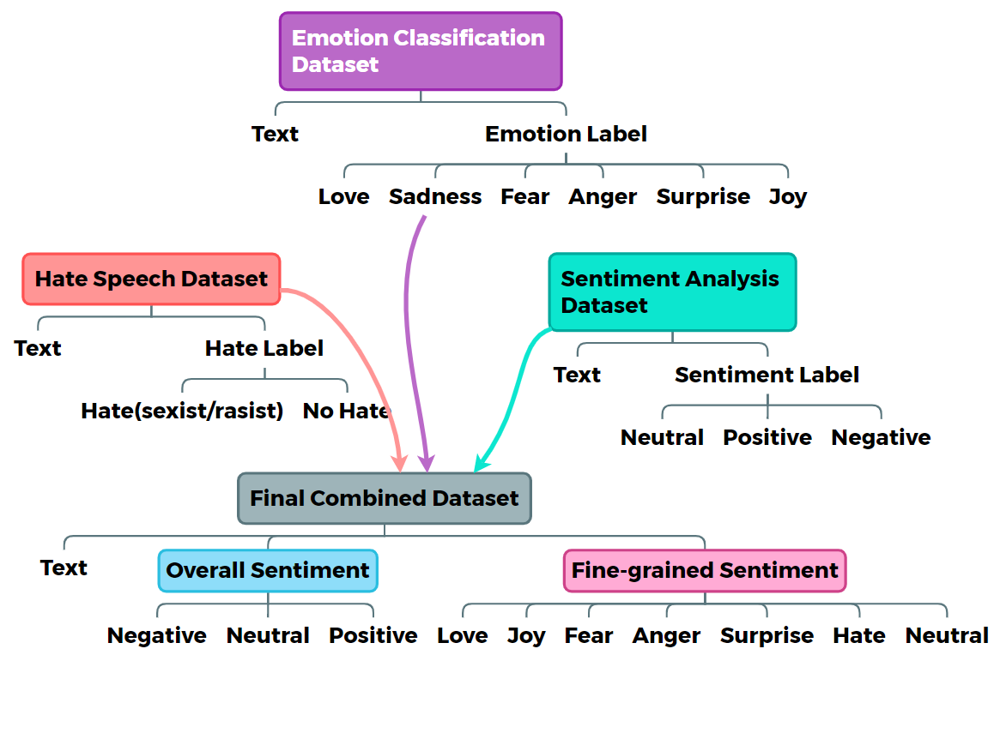
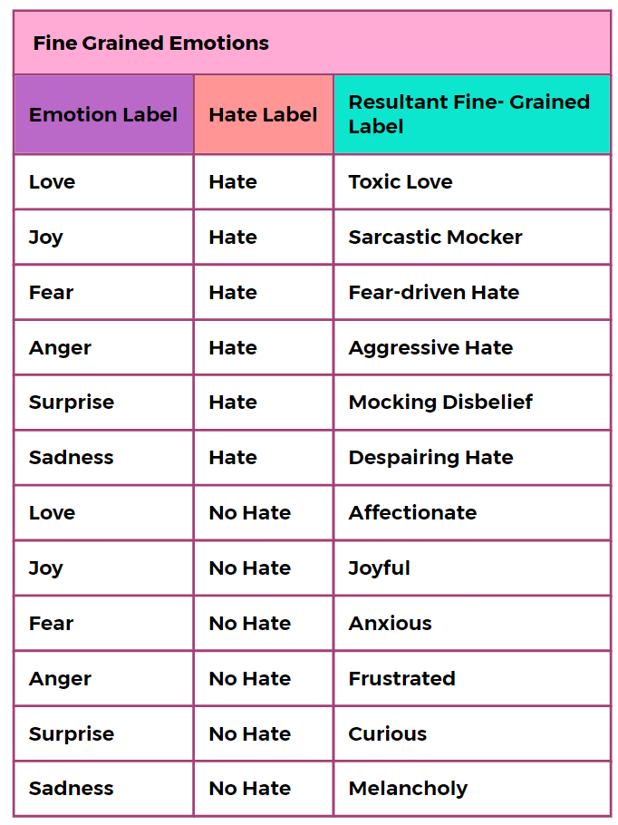
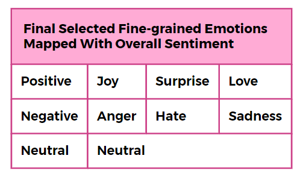
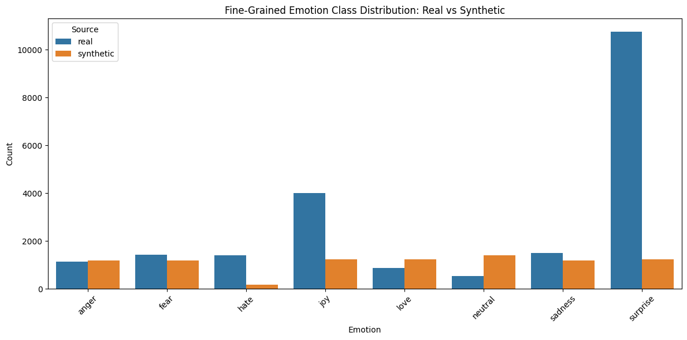
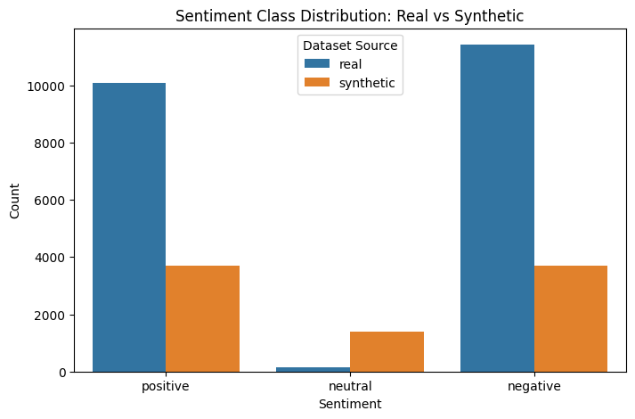
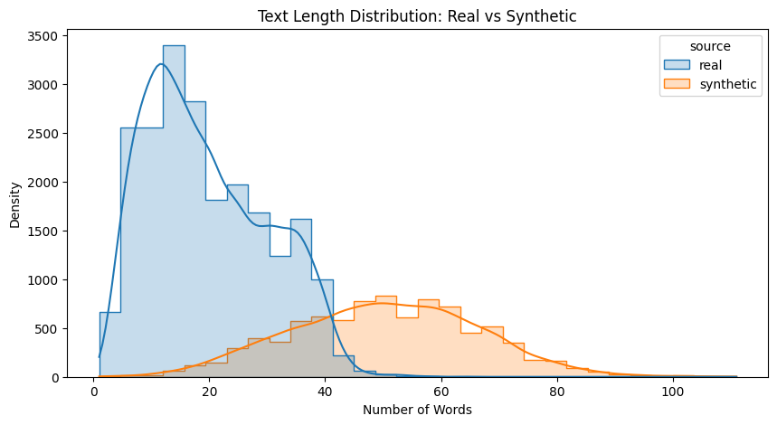
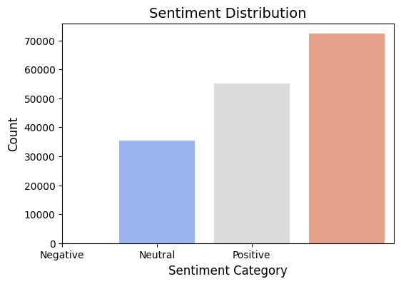
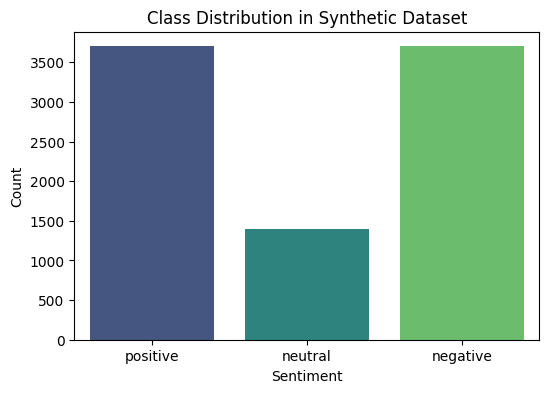
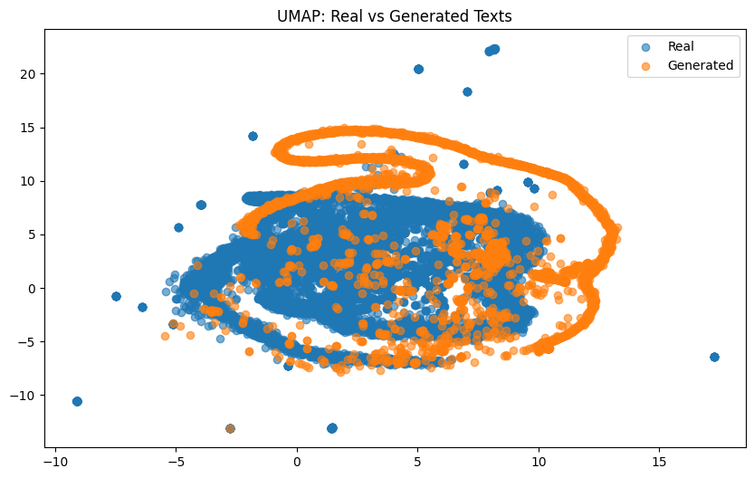

# 🧠 Synthetic Data Generation for Sentiment Analysis

This repository presents a privacy-preserving pipeline for generating **synthetic sentiment and emotion-labeled text** using real Twitter datasets. It addresses challenges related to **data scarcity, class imbalance, and privacy concerns** in sentiment analysis.

## 📌 Overview

This project explores synthetic data generation using **FLAN-T5**, with validation through **XLNet**, and benchmarking using **transformer models** (DistilBERT, RoBERTa, BERT) and traditional ML models. It unifies and enriches real-world datasets with harmonized labels and applies **sampling, validation, and comparative evaluations** across real, synthetic, and hybrid datasets.

---

## 📂 Datasets Used

* **Twitter Sentiment Dataset** – 162K samples (`positive`, `neutral`, `negative`)
* **Twitter Emotion Dataset** – 20K samples (`joy`, `love`, `anger`, etc.)
* **Twitter Hate Speech Dataset** – 49K samples (`hate`, `non-hate`)

---

## ⚙️ Methodology

### 1. **Dataset Harmonization**



### 2. **Label Validation**

* **Sentiment**: Ensemble of original label, VADER, and BERT-based predictions.
* **Emotion**: Ensemble of transformer-based models + rule-based filtering.

### 3. **Synthetic Data Generation**

* Used **FLAN-T5** (HuggingFace) to generate text aligned with sentiment-emotion mappings.
* Prompt:
  *“Generate a tweet that expresses {emotion} with an overall {sentiment} sentiment.”*
* Addressed noise using mapping rules and class filtering.

### 4. **Validation of Generated Data**

* Verified with **XLNet** classifier.
* Filtered out samples with label mismatch.

### 5. **Evaluation**

* Trained models on:

  * Real-only
  * Synthetic-only
  * Real + Synthetic data
* Visualized using **UMAP**.
* Assessed similarity using **Jaccard score** (≈0.83).

---

## 🧪 Results

### 📊 Performance Table

| Model                   | Real Data Accuracy | Synthetic Data Accuracy | Hybrid Accuracy |
| ----------------------- | ------------------ | ----------------------- | --------------- |
| **DistilBERT**          | 98%                | 72%                     | 89%             |
| **RoBERTa**             | 97%                | 73%                     | 90%             |
| **Logistic Regression** | 90%                | 72%                     | 83%             |

### 🧬 Complex Emotion Mapping



### 🗺 Final Label Mapping Table



### 📈 Class Distributions

**Fine-Grained Emotions: Real vs Synthetic**


**Overall Sentiment: Real vs Synthetic**


**Text Length Distribution: Real vs Synthetic**


**Real Dataset Sentiment Distribution**


**Synthetic Dataset Sentiment Distribution**


### 📌 UMAP Visualization



### 📏 Diversity Score

* **Jaccard Similarity**: 0.83 (approx.)

---

## 🚀 Tools & Technologies

* Python, Google Colab, HuggingFace Transformers
* FLAN-T5, XLNet, DistilBERT, RoBERTa, BERT
* VADER, Scikit-learn, UMAP, Matplotlib

---

## 🎯 Conclusion

* Synthetic data can effectively augment real datasets, especially when data is scarce or privacy-sensitive.
* Transformer models are significantly better than traditional ML for nuanced emotion classification.
* Combining real and synthetic data improves generalizability.

---

## 🔭 Future Work

* Improve generation for low-frequency labels (e.g., hate, fear).
* Fine-tune LLMs for higher quality and domain-specific generation.
* Add style-transfer and privacy risk evaluation (e.g., membership inference attacks).

---

## 📁 Repository Structure

```
├── data/                    # Preprocessed and harmonized datasets
├── models/                  # Fine-tuned and trained model checkpoints
├── notebooks/               # Jupyter notebooks for generation and training
├── reports/                 # Result analysis, graphs, and UMAP plots
├── images/                  # Visualizations and result plots used in README
├── src/                     # Core Python scripts for processing and modeling
└── README.md
```

---

## 👩‍💻 Author

**Avanti Makarand Thale**
M.Tech CSE (Data Science), SVNIT Surat
*Guided by: Dr. Sankita J. Patel*
